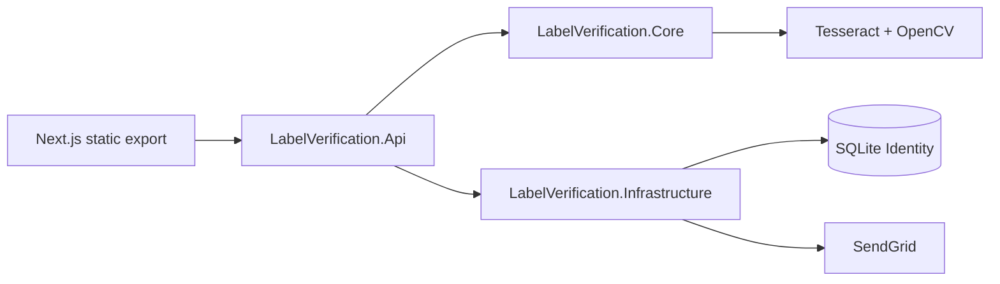

# Architecture

## Projects

| Project | Responsibility |
|---------|----------------|
| `LabelVerification.Core` | OCR, preprocessing, matchers, `IVerificationService` |
| `LabelVerification.Infrastructure` | EF Identity, demo seeding, SendGrid approval mail |
| `LabelVerification.Api` | Minimal APIs, middleware, static `wwwroot` |
| `LabelVerification.Tests` | Fixture + auth integration tests |

## API surface

- `POST /api/v1/auth/register|login|logout`
- `GET /api/v1/auth/me`
- `GET /api/v1/auth/approve?token=&action=approve|deny`
- `POST /api/v1/verify` (multipart: `image`, `expected` JSON)
- `POST /api/v1/verify/batch` (multipart: `images`, `expectedList` JSON array — or legacy single `expected` applied to all images)
- `GET /health/live`, `GET /health/ready`

## Deployment topology

**Container (recommended)**

- Multi-stage Dockerfile: `dotnet publish` + `pnpm build` → runtime aspnet image
- Tessdata copied to `/app/tessdata`
- SQLite file on mounted volume `/data/auth.db`

**Azure App Service**

- Deploy container from ACR
- App Settings for SendGrid + registration flags
- Persistent storage for SQLite or migrate to Azure SQL

## Concurrency

- `OcrConcurrencyGate`: global semaphore (`OCR_MAX_PARALLEL`, default 2)
- `OcrPerUserLimiter`: per-user OCR slot (`OCR_MAX_PER_USER`, default 1)
